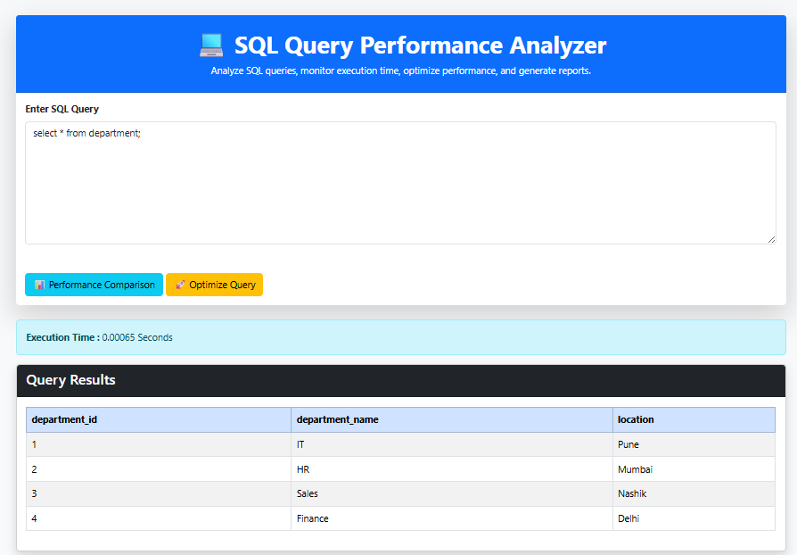
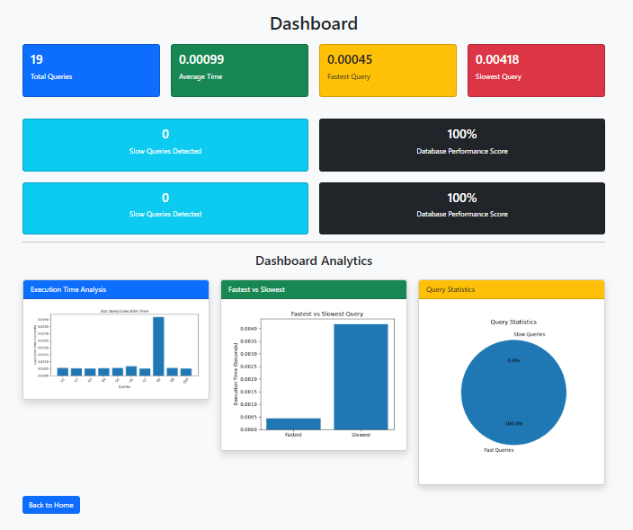
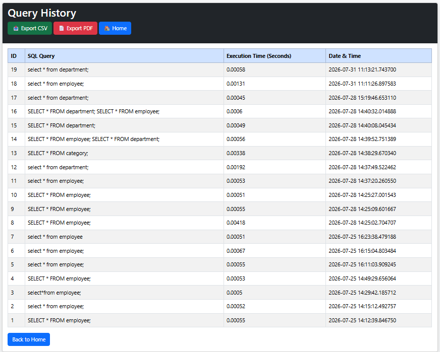
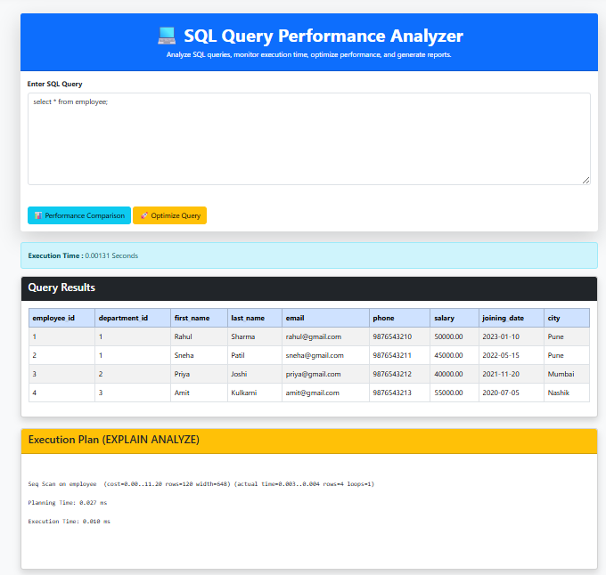
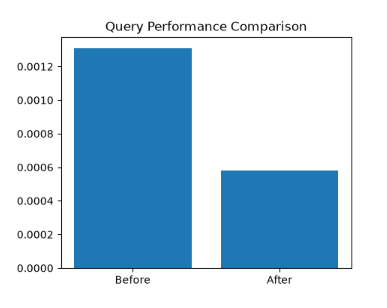

# SQL Query Performance Analyzer

## Project Overview

SQL Query Performance Analyzer is a web-based application developed using Flask and PostgreSQL to analyze SQL query performance.

The system allows users to execute SQL queries, measure execution time, analyze query execution plans using EXPLAIN ANALYZE, and receive optimization suggestions.

## Features

- SQL Query Execution
- Execution Time Measurement
- PostgreSQL Database Integration
- EXPLAIN ANALYZE Query Plan Analysis
- Query Optimization Recommendations
- Query History Management
- Performance Dashboard
- Execution Time Graph Visualization
- Fastest and Slowest Query Analysis
- CSV and PDF Report Generation

## Technologies Used

### Backend
- Python
- Flask

### Database
- PostgreSQL

### Frontend
- HTML
- CSS
- Bootstrap

### Visualization
- Matplotlib

## Project Structure
## Screenshots

### Home Page

### Dashboard

### Query History

### Query Optimization

### Performance Comparison
